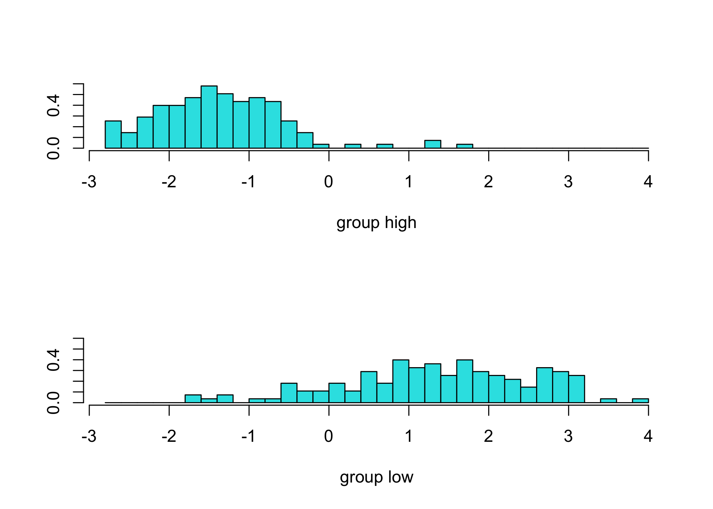

P8106 Data Science II Homework 3: Predicting Gas Milage
================
Sarah Forrest - sef2183
3/24/2023

# Data

In this exercise, we build a model to predict whether a given car gets
high or low gas mileage based on a set of predictors from the dataset
“auto.csv”. The dataset contains 392 observations. The response variable
is `mpg_cat`, which indicates whether the miles per gallon of a car is
high or low.

``` r
# read in data
auto = read.csv("data/auto.csv") 
```

Split the dataset into two parts: training data (70%) and test data
(30%):

``` r
set.seed(1)

# specify rows of training data (70% of the dataset)
rowTrain <- createDataPartition(y = auto$mpg_cat, 
                              p = .7,
                              list = F)
```

Mutate the data so the outcome variable `mpg_cat` takes numberic values
of 0 and 1 rather than character values “low” and “high” in order to run
the `glm()` function:

``` r
auto_glm = 
  auto %>%
  mutate(mpg_cat = case_when(
    mpg_cat == "low" ~ 0,
    mpg_cat == "high" ~ 1))
```

# (a) Perform a logistic regression using the training data.

``` r
set.seed(1)

glm.fit <- glm(mpg_cat ~ .,
               data = auto_glm,
               subset = rowTrain,
               family = binomial(link = "logit"))

summary(glm.fit)
```

    ## 
    ## Call:
    ## glm(formula = mpg_cat ~ ., family = binomial(link = "logit"), 
    ##     data = auto_glm, subset = rowTrain)
    ## 
    ## Deviance Residuals: 
    ##      Min        1Q    Median        3Q       Max  
    ## -2.74516  -0.12820   0.00369   0.19125   2.92173  
    ## 
    ## Coefficients:
    ##                Estimate Std. Error z value Pr(>|z|)    
    ## (Intercept)  -3.100e+01  8.004e+00  -3.873 0.000107 ***
    ## cylinders     1.802e-01  5.549e-01   0.325 0.745462    
    ## displacement  5.391e-04  1.545e-02   0.035 0.972172    
    ## horsepower   -2.259e-02  2.919e-02  -0.774 0.438934    
    ## weight       -5.095e-03  1.417e-03  -3.597 0.000322 ***
    ## acceleration  9.873e-02  1.672e-01   0.591 0.554766    
    ## year          5.713e-01  1.071e-01   5.332 9.69e-08 ***
    ## origin        9.645e-01  4.675e-01   2.063 0.039083 *  
    ## ---
    ## Signif. codes:  0 '***' 0.001 '**' 0.01 '*' 0.05 '.' 0.1 ' ' 1
    ## 
    ## (Dispersion parameter for binomial family taken to be 1)
    ## 
    ##     Null deviance: 382.62  on 275  degrees of freedom
    ## Residual deviance: 107.69  on 268  degrees of freedom
    ## AIC: 123.69
    ## 
    ## Number of Fisher Scoring iterations: 8

Based on the summary of the logistic regression model printed above,
some predictors in the model appear to be statistically significant at
at least the 5% level of significance. The predictors that are
statistically significant are: `weight` (vehicle weight (lbs.)), `year`
(model year (modulo 100)), and `origin` (origin of car - options
include: American, European, or Japanese).

**Confusion matrix using the test data with a probability threshold set
to 0.50 to determine class labels**

``` r
test.pred.prob <- predict(glm.fit, newdata = auto_glm[-rowTrain,],
                          type = "response")

test.pred <- rep("0", length(test.pred.prob))
test.pred[test.pred.prob > 0.5] <- "1"

confusionMatrix(data = as.factor(test.pred),
                reference = as.factor(auto_glm$mpg_cat[-rowTrain]),
                positive = "1")
```

    ## Confusion Matrix and Statistics
    ## 
    ##           Reference
    ## Prediction  0  1
    ##          0 51  7
    ##          1  7 51
    ##                                           
    ##                Accuracy : 0.8793          
    ##                  95% CI : (0.8058, 0.9324)
    ##     No Information Rate : 0.5             
    ##     P-Value [Acc > NIR] : <2e-16          
    ##                                           
    ##                   Kappa : 0.7586          
    ##                                           
    ##  Mcnemar's Test P-Value : 1               
    ##                                           
    ##             Sensitivity : 0.8793          
    ##             Specificity : 0.8793          
    ##          Pos Pred Value : 0.8793          
    ##          Neg Pred Value : 0.8793          
    ##              Prevalence : 0.5000          
    ##          Detection Rate : 0.4397          
    ##    Detection Prevalence : 0.5000          
    ##       Balanced Accuracy : 0.8793          
    ##                                           
    ##        'Positive' Class : 1               
    ## 

The confusion matrix is showing that \[\].

# (b) Train a multivariate adaptive regression spline (MARS) model using the training data.

``` r
set.seed(1)

ctrl <- trainControl(method = "repeatedcv",
                     summaryFunction = twoClassSummary,
                     classProbs = TRUE)

model.mars <- train(x = auto[rowTrain,1:7],
                    y = as.factor(auto$mpg_cat[rowTrain]),
                    method = "earth",
                    tuneGrid = expand.grid(degree = 1:4,
                                           nprune = 2:20),
                    metric = "ROC",
                    trControl = ctrl)

plot(model.mars)
```

<!-- -->

# (c) Perform LDA using the training data.

``` r
set.seed(1)

lda.fit <- lda(mpg_cat~., data = auto,
               subset = rowTrain)

lda.pred <- predict(lda.fit, newdata = auto[-rowTrain,])

head(lda.pred$posterior)
```

    ##            high       low
    ## 5  0.0019297776 0.9980702
    ## 7  0.0007443165 0.9992557
    ## 8  0.0007465888 0.9992534
    ## 10 0.0018972169 0.9981028
    ## 11 0.0027246145 0.9972754
    ## 13 0.0005669965 0.9994330

/\* lda.fit$scaling head(predict(lda.fit)$x) mean(predict(lda.fit)\$x)

auto_t \<- auto_glm\[rowTrain,\] x_l\_tr \<-
auto_t\[auto_t$mpg_cat == "low", 1:7] x_h_tr <- auto_t[auto_t$mpg_cat ==
“high”, 1:7\] cov.low \<- cov(x_l\_tr) cov.high \<- cov(x_h\_tr) n.low
\<- nrow(x_l\_tr) n.high \<- nrow(x_h\_tr) n \<- n.low + n.high K \<- 2
W \<- 1/(n - K) \* (cov.low \* (n.low - 1) + cov.high \* (n.high - 1))
t(lda.fit$scaling) %*% W %*% lda.fit$scaling \*/

## Plot of the linear discriminants in LDA

# (d) Prediction of the response variable.

``` r
plot(lda.fit) # check if correct
```

<!-- -->

I would use the \[\] model to predict the response variable, `mpg_cat`.

## Plot of ROC curve using the test data.

``` r
set.seed(1)

roc <- roc(auto$mpg_cat[-rowTrain], test.pred.prob)
plot(roc, legacy.axes = TRUE, print.auc = TRUE)
plot(smooth(roc), col = 4, add = TRUE)
```

<!-- -->

The AUC is 0.963. The misclassification error rate is \[\].
