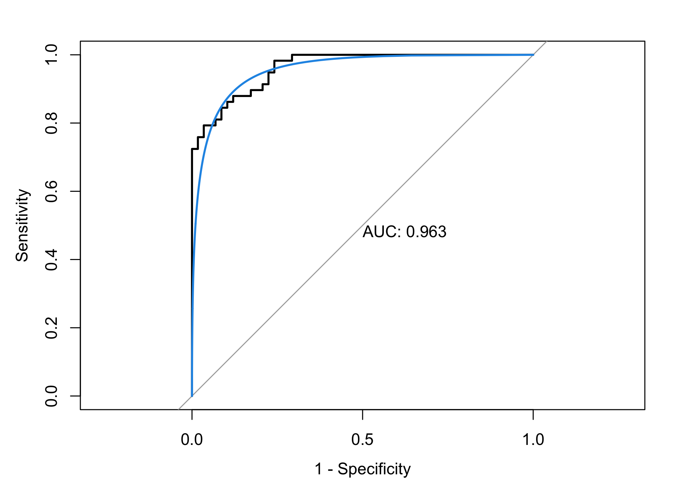

P8106 Data Science II Homework 3: Predicting Gas Milage
================
Sarah Forrest - sef2183
3/24/2023

# Data

In this exercise, we build a model to predict whether a given car gets
high or low gas mileage based on a set of predictors from the dataset
“auto.csv”. The dataset contains 392 observations. The response variable
is `mpg_cat`, which indicates whether the miles per gallon of a car is
high or low.

``` r
# read in data
auto = read.csv("data/auto.csv") 
```

Split the dataset into two parts: training data (70%) and test data
(30%):

``` r
set.seed(1)

# specify rows of training data (70% of the dataset)
rowTrain <- createDataPartition(y = auto$mpg_cat, 
                              p = .7,
                              list = F)
```

Mutate the data so the outcome variable `mpg_cat` takes numeric values
of 0 and 1 rather than character values “low” and “high” in order to run
the `glm()` function:

``` r
auto_glm = 
  auto %>%
  mutate(mpg_cat = case_when(
    mpg_cat == "low" ~ 0,
    mpg_cat == "high" ~ 1))
```

# (a) Perform a logistic regression using the training data.

``` r
set.seed(1)

glm.fit <- glm(mpg_cat ~ .,
               data = auto_glm,
               subset = rowTrain,
               family = binomial(link = "logit"))

summary(glm.fit)
## 
## Call:
## glm(formula = mpg_cat ~ ., family = binomial(link = "logit"), 
##     data = auto_glm, subset = rowTrain)
## 
## Deviance Residuals: 
##      Min        1Q    Median        3Q       Max  
## -2.74516  -0.12820   0.00369   0.19125   2.92173  
## 
## Coefficients:
##                Estimate Std. Error z value Pr(>|z|)    
## (Intercept)  -3.100e+01  8.004e+00  -3.873 0.000107 ***
## cylinders     1.802e-01  5.549e-01   0.325 0.745462    
## displacement  5.391e-04  1.545e-02   0.035 0.972172    
## horsepower   -2.259e-02  2.919e-02  -0.774 0.438934    
## weight       -5.095e-03  1.417e-03  -3.597 0.000322 ***
## acceleration  9.873e-02  1.672e-01   0.591 0.554766    
## year          5.713e-01  1.071e-01   5.332 9.69e-08 ***
## origin        9.645e-01  4.675e-01   2.063 0.039083 *  
## ---
## Signif. codes:  0 '***' 0.001 '**' 0.01 '*' 0.05 '.' 0.1 ' ' 1
## 
## (Dispersion parameter for binomial family taken to be 1)
## 
##     Null deviance: 382.62  on 275  degrees of freedom
## Residual deviance: 107.69  on 268  degrees of freedom
## AIC: 123.69
## 
## Number of Fisher Scoring iterations: 8
```

Based on the summary of the logistic regression model printed above,
some predictors in the model appear to be statistically significant at
at least the 5% level of significance. The predictors that are
statistically significant are: `weight` (vehicle weight (lbs.)), `year`
(model year (modulo 100)), and `origin` (origin of car - options
include: American, European, or Japanese).

**Confusion matrix using the test data with a probability threshold set
to 0.50 to determine class labels**

``` r
test.pred.prob <- predict(glm.fit, newdata = auto_glm[-rowTrain,],
                          type = "response")

test.pred <- rep("0", length(test.pred.prob))
test.pred[test.pred.prob > 0.5] <- "1"

confusionMatrix(data = as.factor(test.pred),
                reference = as.factor(auto_glm$mpg_cat[-rowTrain]),
                positive = "1")
## Confusion Matrix and Statistics
## 
##           Reference
## Prediction  0  1
##          0 51  7
##          1  7 51
##                                           
##                Accuracy : 0.8793          
##                  95% CI : (0.8058, 0.9324)
##     No Information Rate : 0.5             
##     P-Value [Acc > NIR] : <2e-16          
##                                           
##                   Kappa : 0.7586          
##                                           
##  Mcnemar's Test P-Value : 1               
##                                           
##             Sensitivity : 0.8793          
##             Specificity : 0.8793          
##          Pos Pred Value : 0.8793          
##          Neg Pred Value : 0.8793          
##              Prevalence : 0.5000          
##          Detection Rate : 0.4397          
##    Detection Prevalence : 0.5000          
##       Balanced Accuracy : 0.8793          
##                                           
##        'Positive' Class : 1               
## 
```

The confusion matrix is showing that the logistic regression model
accurately predicted 51 of the data points as having low gas mileage and
51 of the data points as having high gas mileage. However, the logistic
regression model incorrectly predicted 7 data points with low gas
mileage as having high gas mileage, and 7 data points with high gas
mileage as having low gas mileage. The resulting prediction accuracy is
87.93% (95% CI: 0.8058, 0.9324), with a No Information Rate (NIR) of
0.5. The kappa statistic takes into account the possibility of agreement
by random chance. The kappa statistic of 0.7586 is closer to 1 (complete
agreement) than to 0 (agreement by chance). It is also greater than a
cutoff value of 0.6, indicating substantial agreement. The proportion of
true positives in the positive observations (sensitivity) is the same as
the proportion of true negatives in the negative observations
(specificity). The value of 0.8793 for sensitivity and specificity is
high, as it is closer to 1 than 0. Additionally, the PPV and NPV are
equal and high, at a value of 0.8793 as well.

# (b) Train a multivariate adaptive regression spline (MARS) model using the training data.

``` r
set.seed(1)

ctrl <- trainControl(method = "repeatedcv",
                     summaryFunction = twoClassSummary,
                     classProbs = TRUE)

mars.fit <- train(x = auto[rowTrain,1:7],
                    y = as.factor(auto$mpg_cat[rowTrain]),
                    method = "earth",
                    tuneGrid = expand.grid(degree = 1:4,
                                           nprune = 2:20),
                    metric = "ROC",
                    trControl = ctrl)

# plot(mars.fit)
```

# (c) Perform LDA using the training data.

``` r
set.seed(1)

lda.fit <- lda(mpg_cat~., data = auto,
               subset = rowTrain)

lda.pred <- predict(lda.fit, newdata = auto[-rowTrain,])
head(lda.pred$posterior)
##            high       low
## 5  0.0019297776 0.9980702
## 7  0.0007443165 0.9992557
## 8  0.0007465888 0.9992534
## 10 0.0018972169 0.9981028
## 11 0.0027246145 0.9972754
## 13 0.0005669965 0.9994330
```

## Plot of the linear discriminants in LDA

``` r
plot(lda.fit)
```

<!-- -->

# (d) Prediction of the response variable.

## Method 1:

First, fit the GLM and LDA models using the caret package (note that the
MARS model was already fit using the caret package):

``` r
set.seed(1)

# fit the GLM model using the training dataset
glm.fit <- train(x = auto[rowTrain,1:7],
                 y = as.factor(auto$mpg_cat[rowTrain]),
                 method = "glm",
                 metric = "ROC",
                 trControl = ctrl) # 10-fold CV

# fit the LDA model using the training dataset
lda.fit <- train(x = auto[rowTrain,1:7],
                y = as.factor(auto$mpg_cat[rowTrain]),
                method = "lda",
                metric = "ROC",
                trControl = ctrl) # 10-fold CV
```

Then, apply the `predict()` function in the caret package to each model
fit using the test dataset:

``` r
set.seed(1)

glm.pred <- predict(glm.fit, newdata = auto[-rowTrain,], type = "prob")[,2]
mars.pred <- predict(mars.fit, newdata = auto[-rowTrain,], type = "prob")[,2]
lda.pred <- predict(lda.fit, newdata = auto[-rowTrain,], type = "prob")[,2]

roc.glm <- roc(auto$mpg_cat[-rowTrain], glm.pred)
roc.mars <- roc(auto$mpg_cat[-rowTrain], mars.pred)
roc.lda <- roc(auto$mpg_cat[-rowTrain], lda.pred)

auc <- c(roc.glm$auc[1], roc.mars$auc[1], roc.lda$auc[1])

modelNames <- c("glm", "mars", "lda")

ggroc(list(roc.glm, roc.mars, roc.lda), legacy.axes = TRUE) +
scale_color_discrete(labels = paste0(modelNames, " (", round(auc,3),")"),
name = "Models (AUC)") +
geom_abline(intercept = 0, slope = 1, color = "grey")
```

<!-- -->

Using this method, I would use the GLM model to predict the response
variable, `mpg_cat` because it has the highest value for area under the
curve (AUC), which indicates best performance.

## Method 2

Fit GLM, MARS, and LDA models using the test dataset, print ROC
value(s), and use the `resamples()` function to calculate the mean AUC
value for each model:

``` r
set.seed(1)

# GLM
model.glm_test <- train(x = auto[-rowTrain,1:7], # test dataset
                   y = as.factor(auto$mpg_cat[-rowTrain]),
                   method = "glm",
                   metric = "ROC",
                   trControl = ctrl) # 10-fold CV

# MARS
model.mars_test <- train(x = auto[-rowTrain,1:7], # test dataset
                    y = as.factor(auto$mpg_cat[-rowTrain]),
                    method = "earth",
                    tuneGrid = expand.grid(degree = 1:4,
                                           nprune = 2:20),
                    metric = "ROC",
                    trControl = ctrl) # 10-fold CV

# LDA
model.lda_test <- train(x = auto[-rowTrain,1:7], # test dataset
                   y = as.factor(auto$mpg_cat[-rowTrain]),
                   method = "lda",
                   metric = "ROC",
                   trControl = ctrl) # 10-fold CV

model.glm_test$results$ROC # print ROC value for GLM model
## [1] 0.9794444
model.mars_test$results$ROC # print ROC values for MARS model
##  [1] 0.9369444 0.9230556 0.9383333 0.9327778 0.9508333 0.9647222 0.9244444
##  [8] 0.9438889 0.9805556 0.9688889 0.9366667 0.9505556 0.9805556 0.9716667
## [15] 0.9300000 0.9438889 0.9750000 0.9716667 0.9077778 0.9327778 0.9750000
## [22] 0.9250000 0.9244444 0.9494444 0.9750000 0.9250000 0.9244444 0.9466667
## [29] 0.9750000 0.9283333 0.9194444 0.9500000 0.9750000 0.9283333 0.9194444
## [36] 0.9500000 0.9750000 0.9227778 0.9194444 0.9500000 0.9750000 0.9227778
## [43] 0.9083333 0.9238889 0.9750000 0.9227778 0.9027778 0.9183333 0.9750000
## [50] 0.9227778 0.9027778 0.9183333 0.9750000 0.9227778 0.9027778 0.9183333
## [57] 0.9750000 0.9227778 0.9027778 0.9183333 0.9750000 0.9227778 0.9027778
## [64] 0.9183333 0.9750000 0.9227778 0.9027778 0.9183333 0.9750000 0.9227778
## [71] 0.9027778 0.9183333 0.9750000 0.9227778 0.9027778 0.9183333
model.lda_test$results$ROC # print ROC value for LDA model
## [1] 0.9518889

res <- resamples(list(GLM = model.glm_test,
                      MARS = model.mars_test,
                      LDA = model.lda_test))
summary(res)
## 
## Call:
## summary.resamples(object = res)
## 
## Models: GLM, MARS, LDA 
## Number of resamples: 10 
## 
## ROC 
##           Min.   1st Qu. Median      Mean 3rd Qu. Max. NA's
## GLM  0.9333333 0.9513889      1 0.9794444       1    1    0
## MARS 0.8611111 1.0000000      1 0.9805556       1    1    0
## LDA  0.8333333 0.9030556      1 0.9518889       1    1    0
## 
## Sens 
##           Min. 1st Qu. Median      Mean 3rd Qu. Max. NA's
## GLM  0.6000000       1      1 0.9433333       1    1    0
## MARS 0.8333333       1      1 0.9666667       1    1    0
## LDA  0.8000000       1      1 0.9633333       1    1    0
## 
## Spec 
##           Min.   1st Qu.    Median      Mean 3rd Qu. Max. NA's
## GLM  0.6666667 0.8750000 1.0000000 0.9166667       1    1    0
## MARS 0.6666667 0.8750000 1.0000000 0.9333333       1    1    0
## LDA  0.8000000 0.8333333 0.8333333 0.8933333       1    1    0
```

Using this method, I would use the MARS model to predict the response
variable, `mpg_cat` because it has the highest value for ROC/AUC.

## Plot of ROC curve using the test data for the GLM model and misclassification error rate.

``` r
set.seed(1)

# plot the ROC curve
roc_glm <- roc(auto$mpg_cat[-rowTrain], test.pred.prob)
plot(roc_glm, legacy.axes = TRUE, print.auc = TRUE)
plot(smooth(roc_glm), col = 4, add = TRUE)
```

<!-- -->

``` r

# compute the confusion matrix and misclassification error rate
cm <- confusionMatrix(data = as.factor(test.pred),
                reference = as.factor(auto_glm$mpg_cat[-rowTrain]),
                positive = "1")

(1 - (cm$overall["Accuracy"])) # misclassification error rate = 1 - accuracy 
##  Accuracy 
## 0.1206897
```

The AUC for the GLM model is 0.963, indicating that the prediction
performance is very good. The misclassification error rate (1 -
accuracy) is 0.1206897 or about 12.07%.
